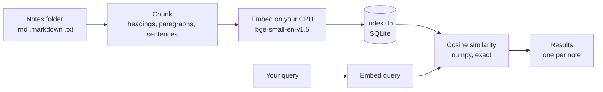

<div align="center">

# dejanote

**Semantic search for your notes, entirely on your machine.**

Find the note you remember, even when you have forgotten the words you used.<br>
Local embeddings, a local index, and a guarantee you can check that nothing leaves your computer.

[](https://github.com/Waiivyy/dejanote/actions/workflows/ci.yml)


[](LICENSE)

</div>


The top result never says "burned out". The note reads *"completely drained"* and *"taking Monday off, no laptop"*, and it is still the first hit, because dejanote matches meaning rather than keywords.

## Contents

- [Features](#features)
- [Quick start](#quick-start)
- [Installation](#installation)
- [Usage](#usage)
- [Privacy](#privacy)
- [How it works](#how-it-works)
- [Search quality](#search-quality)
- [Performance](#performance)
- [Configuration](#configuration)
- [FAQ](#faq)
- [Development](#development)
- [Roadmap](#roadmap)
- [License and acknowledgements](#license-and-acknowledgements)

## Features

- **Search by meaning.** Finds the notes that discuss your idea in other words, ranked by semantic similarity, and points at the exact section and line.
- **Private by design.** Embedding, indexing and search all run locally. After a one-time model download dejanote never uses the network, and every command ends with a receipt that says so.
- **Verifiable.** A built-in `verify` command, plus operating-system checks that do not rely on dejanote's own word. CI runs those checks on every commit.
- **Section-level results.** Notes are split by heading, then paragraph, then sentence, so a result is the passage that answers you rather than a multi-page file.
- **Incremental indexing.** Notes are tracked by content hash and only new or changed ones are embedded. An unchanged folder of 3,000 notes is rechecked in under a second.
- **Interactive browser.** `dejanote browse` searches as you type, previews each match and opens it in your editor at the matching line.
- **Watch mode.** `dejanote watch` keeps the index current while you edit, so a note is searchable a moment after you save it.
- **Plain files.** Works on any folder of Markdown and text files, Obsidian vaults included. Nothing is imported, converted or moved.

## Quick start

```bash
git clone https://github.com/Waiivyy/dejanote && cd dejanote
python3 -m venv .venv && source .venv/bin/activate
pip install .
dejanote setup                                       # one-time model download, see Privacy
dejanote index examples/notes                        # 26 bundled example notes
dejanote search "felt burned out and needed a break"
dejanote browse                                      # search as you type
```

Then point it at your own notes with `dejanote index ~/path/to/notes`.

## Installation

| Requirement | |
|---|---|
| Python | 3.10 or newer |
| Operating system | macOS or Linux, both tested in CI. Windows is untested. |
| Disk space | About 1 GB for the dependencies, mostly PyTorch, plus 135 MB for the model |
| Hardware | Any recent CPU. No GPU is needed. |

Install from GitHub (dejanote is not published on PyPI):

```bash
pip install git+https://github.com/Waiivyy/dejanote
```

On Linux, install the CPU-only build of PyTorch first. The default build bundles CUDA and is several times larger:

```bash
pip install torch --index-url https://download.pytorch.org/whl/cpu
```

The very first command after installing takes about half a minute longer than usual while Python compiles PyTorch's modules. After that, commands start in a few seconds.

## Usage

| Command | What it does | Network |
|---|---|---|
| `dejanote setup` | Downloads the embedding model, after asking | Once, to Hugging Face |
| `dejanote index FOLDER` | Builds or updates the index for a folder | Never |
| `dejanote search QUERY` | Prints the notes that best match a query | Never |
| `dejanote browse [QUERY]` | Searches interactively as you type | Never |
| `dejanote watch FOLDER` | Keeps the index current while you edit | Never |
| `dejanote verify` | Checks that the install works with the network blocked | Never |

Every command has `--help`.

### `dejanote setup`

Downloads the embedding model once. It shows exactly what it is about to fetch and asks first; `--yes` skips the question.

```
$ dejanote setup
dejanote needs its embedding model on this machine. This one-time download
is the only time dejanote uses the network. Your notes are not read or sent.

  model     BAAI/bge-small-en-v1.5
  revision  5c38ec7c405ec4b44b94cc5a9bb96e735b38267a (pinned)
  from      https://huggingface.co
  size      about 135 MB, 11 files, each checked against a pinned sha256
  to        ~/.dejanote/models/bge-small-en-v1.5

Download it now? [y/N]: y
Done. Model saved to ~/.dejanote/models/bge-small-en-v1.5
From here on, dejanote works fully offline.
```

### `dejanote index FOLDER`

Indexes every `.md`, `.markdown` and `.txt` file under the folder, skipping hidden files and folders such as `.obsidian` and `.trash`. Run it as often as you like: only new and changed notes are embedded, and notes you delete drop out of the index.

```
$ dejanote index examples/notes
Indexed 26 notes from examples/notes (26 new). Embedded 98 chunks in 3.8s.
Index: ~/.dejanote/index.db
No network connections were attempted.

$ dejanote index examples/notes
Indexed 26 notes from examples/notes (26 unchanged). Nothing new to embed (0.0s).
Index: ~/.dejanote/index.db
No network connections were attempted.
```

Several folders can share one index; each run only touches the folder you name.

### `dejanote search QUERY`

Prints the best-matching notes, one result per note: the similarity score, a clickable `path:line`, the heading path of the matching section and a snippet. Other strong sections of the same note are listed under it. `--limit N` sets how many notes to show (default 5).

```
$ dejanote search "the heating stopped and the gauge is low" --limit 1
0.71  examples/notes/home/boiler-pressure.md:7
      Boiler pressure > Normal range
      The gauge should read between 1 and 1.5 bar when the system is cold. Up to
      about 2 bar while the heating is running is fine. Below 0.5 it locks out.
      also: intro (line 3)

No network connections were attempted.
```

Scores are cosine similarities. With the default model, around 0.7 and above is a strong match and unrelated text still scores around 0.4 to 0.5, so compare scores with each other rather than reading them as percentages.

### `dejanote browse [QUERY]`

Searches as you type. The model loads once when the browser opens, and from then on results follow your keystrokes within a fraction of a second.


| Key | Action |
|---|---|
| Type | Search |
| `↑` `↓` | Move through the results; the preview follows |
| `Enter` | Open the note in `$VISUAL` or `$EDITOR` at the matching line |
| `Esc` | Quit |

Without an editor configured, `Enter` quits and prints the note's `path:line`, so the browser also works as a picker in scripts. The status line carries the same network receipt as every other command. The browser reads the index when it opens; notes indexed while it is open appear the next time you start it.

### `dejanote watch FOLDER`

Brings the index up to date, then reindexes notes as soon as they change, until you press `Ctrl+C`. The model stays loaded, so each change is searchable within a second or two of saving. A real session:

```
$ dejanote watch notes
Watching notes for changes. Press Ctrl+C to stop.
16:57:16  added 26 notes (98 chunks embedded, 0.63s)
16:57:48  updated cooking/sourdough-starter.md (6 chunks embedded, 0.06s)
16:57:48  added garden/peppers.md (1 chunk embedded, 0.02s)
16:57:48  removed ideas/side-projects.md
Stopped watching.
No network connections were attempted.
```

Like `index`, it ignores hidden files and folders, and it also ignores editor swap and backup files.

### `dejanote verify`

Checks the installation: every model file against its pinned hash, then a full index and search of sample notes in a throwaway index, with the network blocked. It exits with an error if anything tried to connect, so it can be used in scripts.

```
$ dejanote verify
Checking dejanote with every network connection blocked.
  Model files match their pinned sha256 hashes.
  Indexed 3 sample notes into a throwaway index.
  Searched for "keeping my bread yeast culture alive": best match sourdough.md.
Network connections attempted: 0. Indexing and search work fully offline.
For a check that does not rely on dejanote's own guard, see "Verify it yourself" in the README.
```

## Privacy

**The promise:** once `dejanote setup` has downloaded the model, dejanote never uses the network. Your notes, your queries and the index stay on your machine.

### The one-time model download

`dejanote setup` is the only command that touches the network, and it asks first. Everything it does is listed here, so it is never mistaken for a hidden API call:

- **What:** 11 files of [BAAI/bge-small-en-v1.5](https://huggingface.co/BAAI/bge-small-en-v1.5), about 135 MB, at a pinned commit.
- **From where:** huggingface.co, plus Hugging Face's CDN for the weights file. That is 34 HTTPS requests in total: one listing of the files at the pinned commit, then metadata checks and a download for each file.
- **What is sent:** nothing but the file requests. No Hugging Face token, even if you have one saved; no telemetry; no extra registry calls. The User-Agent only names library versions, for example `unknown/None; hf_hub/1.33.0; python/3.12.12`. Your notes are not read.
- **Integrity:** every file is checked against a sha256 pinned in the [source code](src/dejanote/embedding.py). Files land in a staging folder and only move into place once all hashes match, so a tampered or interrupted download is never used.
- **Where it goes:** `~/.dejanote/models`. Nothing is written to `~/.cache/huggingface` or anywhere else.

Behind a corporate proxy that inspects TLS, `setup` verifies certificates against your operating system's certificate store, as pip does. Certificate verification is never switched off.

### How it is enforced

1. **Offline mode.** Every other command switches the Hugging Face libraries to offline mode before they load.
2. **A network guard.** Outbound connections, UDP sends and DNS lookups from the dejanote process are blocked and recorded. Local Unix sockets stay allowed.
3. **A receipt.** Every run ends with `No network connections were attempted.`, or with a warning that lists exactly what was blocked; `browse` shows the same in its status line. Nothing gets out either way.

The guard lives inside Python. Native code or a child process could in principle get past it, which is why you should not have to take dejanote's word for it.

### Verify it yourself

Let the operating system take the network away, then use dejanote as usual. Each recipe starts with a control: if `curl` can still reach the internet, the sandbox is not working and the test proves nothing.

**macOS**, with a sandbox that denies all networking:

```
$ sandbox-exec -p '(version 1)(allow default)(deny network*)' curl https://example.com
curl: (6) Could not resolve host: example.com
$ sandbox-exec -p '(version 1)(allow default)(deny network*)' dejanote search "felt burned out and needed a break" --limit 1
0.64  examples/notes/journal/2024-05-12.md:1
      2024-05-12
      Rough week. Shipped the migration on Friday after three late nights and I
      am completely drained. Snapped at Ben in standup on Thursday over
      something tiny; apologised afterwards, but it has been bugging me.
      Went for a long walk by the...

No network connections were attempted.
```

The same works for `index`, `browse` and `watch`.

**Linux**, in a network namespace that has no network at all:

```bash
export DEJANOTE_HOME=~/.dejanote
sudo unshare --net curl https://example.com          # control: must fail
sudo --preserve-env=DEJANOTE_HOME unshare --net "$(command -v dejanote)" index examples/notes
sudo --preserve-env=DEJANOTE_HOME unshare --net "$(command -v dejanote)" search "felt burned out and needed a break"
```

**Anywhere:** turn off Wi-Fi or unplug the cable, then index and search.

**On every commit:** [CI](.github/workflows/ci.yml) runs these checks on Linux and macOS. With the network taken away by the operating system and the control confirming it, `verify`, a fresh `index` of the example notes and a `search` must all succeed. The logs are public on the [Actions tab](https://github.com/Waiivyy/dejanote/actions/workflows/ci.yml).

### What is stored, and where

Everything lives in `~/.dejanote`, or wherever `DEJANOTE_HOME` points:

- `models/bge-small-en-v1.5/` holds the model.
- `index.db` is one SQLite file with each note's path and content hash, and for every chunk its text, heading path, line numbers and embedding.

The index contains the text of your notes, so treat it like the notes themselves, for example if you back up or sync your home folder. Deleting the folder removes every trace: `rm -rf ~/.dejanote`.

### Scope

dejanote can promise what dejanote does. It cannot promise what other software does: the editor that `browse` opens is a separate program, a backup or sync service may copy `~/.dejanote` elsewhere, and anything else running on your computer is outside its reach.

## How it works



1. **Find notes.** `.md`, `.markdown` and `.txt` files, recursively, skipping hidden files and folders.
2. **Chunk.** Notes are split at headings first, so every chunk is one section and keeps its heading path, such as `Sourdough starter > Feeding`. Long sections are split between paragraphs, and only a paragraph that is too long on its own is split between sentences (or between lines, for lists and code). Nothing is cut at an arbitrary character count. Chunks hold at most about 150 words, so a result points at one passage. Front matter, code fences and `#tags` are handled.
3. **Embed.** Each chunk is embedded together with its heading path, so "Discard all but 50 g, then add 50 g flour" is understood as being about feeding a sourdough starter. Queries get the instruction the model was trained with.
4. **Store.** One SQLite file, with float32 vectors next to the text. Every note's sha256 is stored too, so the next run skips unchanged notes without embedding them again. Changing the model or the chunking rules rebuilds the index automatically.
5. **Search.** One matrix-vector product gives the exact cosine similarity between the query and every chunk; there is no approximate index. Results are then grouped by note.

## Search quality

[examples/queries.json](examples/queries.json) holds 46 queries over the example notes, written the way people search and mostly paraphrased, so they share few words with the note that answers them. [scripts/evaluate.py](scripts/evaluate.py) indexes the examples with each candidate model and scores where the expected note and section rank:

| Model | Right note first | In top 3 | Right section first | In top 3 | MRR |
|---|---|---|---|---|---|
| **bge-small-en-v1.5** (default) | **0.98** | **1.00** | **0.79** | **1.00** | **0.99** |
| all-MiniLM-L6-v2 | 0.91 | 0.98 | 0.76 | 0.94 | 0.94 |
| multi-qa-MiniLM-L6-cos-v1 | 0.89 | 0.93 | 0.76 | 0.91 | 0.92 |

bge-small became the default because of this table: it fixed exactly the paraphrased queries the others missed. Two caveats apply. The same person wrote the notes and the queries, and 46 queries is a small set. The ranking agrees with public retrieval benchmarks, but your own notes are the real test. Reproduce it with `python scripts/evaluate.py --all --misses`.

## Performance

Measured on an Apple Silicon laptop CPU with 3,016 notes (11,368 chunks):

| Operation | Time |
|---|---|
| First index | about 70 s |
| Index again, nothing changed | 0.8 s |
| Index again after editing one note | 5.1 s |
| One `search` | 3.9 s |
| `browse`: opening, then each search | about 5 s once, then about 0.2 s |
| `watch`: from saving a note to it being searchable | about 0.6 s |

The index for those 3,016 notes is 26 MB. Of a `search`'s 3.9 seconds, embedding the query and ranking every chunk take about 50 ms; most of the rest is Python importing sentence-transformers and its dependencies on every run. That cost is why `browse` and `watch` exist: they pay it once. On each save, `watch` finds what changed by re-reading and hashing the folder, which for 3,016 notes takes about half a second; embedding the edited note itself takes a few hundredths of a second.

## Configuration

| Variable | Effect |
|---|---|
| `DEJANOTE_HOME` | Where the model and the index live. Defaults to `~/.dejanote`. |
| `VISUAL`, `EDITOR` | The editor `browse` opens notes in, `VISUAL` first. Terminal editors get `+line path`; VS Code, Cursor and similar get `-g path:line`; Zed, Sublime Text and Helix get `path:line`. |
| `DEJANOTE_REQUIRE_MODEL` | For development: tests that need the model fail instead of being skipped. |

## FAQ

**Does it work with Obsidian?** Yes. A vault is a folder of Markdown files; dejanote indexes the notes and skips `.obsidian` and `.trash`. It never writes to the vault.

**Does it understand languages other than English?** The default model is trained on English text. Other languages may partly work, but search quality has only been measured in English.

**What happens when I move or rename a note?** The index is keyed by path, so the next `index` or `watch` run treats it as one note removed and one added, and embeds it again.

**Is the index encrypted?** No. `index.db` is an ordinary SQLite file that contains the text of your notes. Protect it as you protect the notes, for example with full-disk encryption.

**Why does a single `search` take a few seconds?** Almost all of it is Python loading the machine learning libraries, which happens on every run. `browse` and `watch` load them once.

**Can I use a different model?** Not from the command line yet. Candidate models are pinned and compared in `scripts/evaluate.py`. If you change the default in [src/dejanote/embedding.py](src/dejanote/embedding.py), the next `index` or `watch` run rebuilds the index for it automatically.

## Development

```bash
git clone https://github.com/Waiivyy/dejanote && cd dejanote
python3 -m venv .venv && source .venv/bin/activate
pip install -e ".[dev]"
dejanote setup     # tests that need the real model are skipped until it is downloaded
pytest
```

The test suite covers chunking, the index, incremental indexing, search, search quality on the example notes, the network guard, the browser (driven headlessly) and watch mode, including real file events. CI runs it on Linux and macOS with the real model, followed by the offline checks above. To refresh the README images, run `python scripts/record_demo.py`.

```
src/dejanote/
  cli.py          the commands
  indexer.py      finds notes, skips unchanged ones, batches embeddings
  chunking.py     splits notes into sections, paragraphs and sentences
  embedding.py    pinned model download and offline embedding
  store.py        the SQLite index and its in-memory snapshot
  search.py       ranking and grouping results by note
  tui.py          the interactive browser
  watcher.py      watch mode
  editor.py       opens a note in $VISUAL or $EDITOR at a line
  privacy.py      offline mode and the network guard
  evaluation.py   search quality scores
  config.py       where files live
  display.py      how paths and counts are written
scripts/          evaluate.py (model comparison), record_demo.py (README images)
examples/         notes/ (26 example notes), queries.json (evaluation queries)
```

## Roadmap

- Highlight the phrase that matched inside each result.
- Let `browse` pick up notes that `watch` indexes while it is open.
- In `watch`, read only the files that changed instead of rehashing the folder, for very large collections.
- Choose among the evaluated models from the command line.
- Index more formats, such as PDF.

## License and acknowledgements

dejanote is released under the [MIT license](LICENSE). The embedding model, [BAAI/bge-small-en-v1.5](https://huggingface.co/BAAI/bge-small-en-v1.5), is downloaded separately from Hugging Face and published by BAAI under the MIT license.

Built with [sentence-transformers](https://github.com/huggingface/sentence-transformers), [PyTorch](https://pytorch.org), [NumPy](https://numpy.org), [Textual](https://github.com/Textualize/textual) and [Rich](https://github.com/Textualize/rich), [Typer](https://github.com/fastapi/typer), [watchfiles](https://github.com/samuelcolvin/watchfiles) and [truststore](https://github.com/sethmlarson/truststore).
