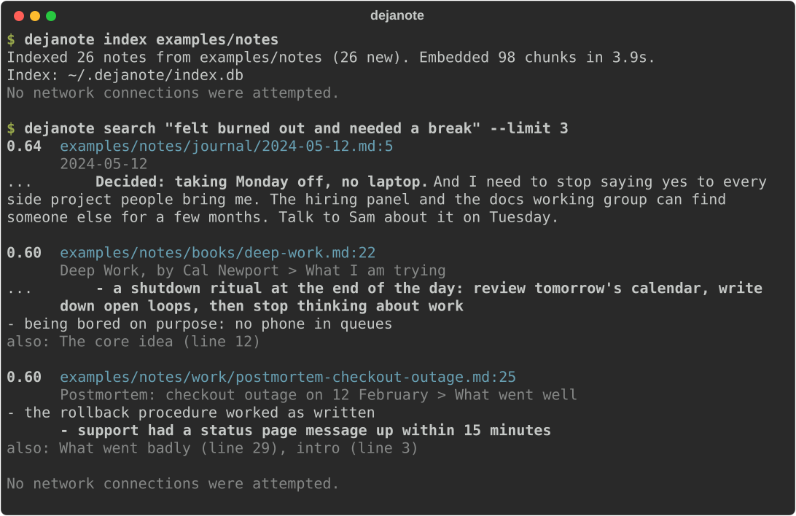
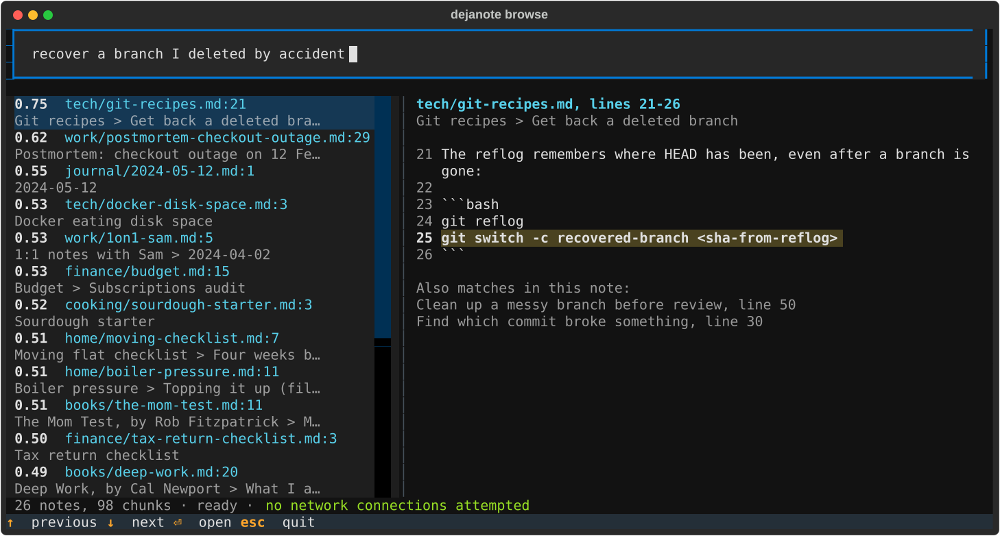

# dejanote

[](https://github.com/Waiivyy/dejanote/actions/workflows/ci.yml)

**Search your notes by meaning, entirely offline.**

dejanote indexes a folder of Markdown and plain-text notes and finds the sections that match what you mean, even when they use different words than your query. Embeddings are created, stored and searched on your own machine. After a one-time model download it never touches the network, and you do not have to take that on trust: [verify it yourself](#verify-it-yourself).



The top result never says "burned out". The note reads *"completely drained"* and *"taking Monday off, no laptop"*, and it is still the first hit. Keyword search would have missed it.

## Why

- **Keyword search misses the right note** when you remember the idea but not the words you used.
- **Semantic search usually means a cloud API.** Your notes get sent somewhere to be embedded and searched. Notes are often the most personal text you own: journals, health, money, work.
- **dejanote does it all locally**: a small embedding model ([BAAI/bge-small-en-v1.5](https://huggingface.co/BAAI/bge-small-en-v1.5), 33M parameters, fine on a laptop CPU, no GPU), one SQLite file as the index, and exact cosine similarity with numpy.

## Quick start

Try it on the bundled example notes:

```bash
git clone https://github.com/Waiivyy/dejanote && cd dejanote
python3 -m venv .venv && source .venv/bin/activate
pip install .
dejanote setup                      # one-time model download, see "Privacy"
dejanote index examples/notes
dejanote search "felt burned out and needed a break"
```

Then point it at your own notes with `dejanote index ~/path/to/notes`, and try `dejanote browse` to search as you type.

## Install

Python 3.10 or newer, on macOS or Linux (both tested in CI; Windows is untested). The dependencies, mostly PyTorch, take about 1 GB of disk, and the model another 135 MB.

```bash
pip install git+https://github.com/Waiivyy/dejanote
```

On Linux, install the CPU-only build of PyTorch first. The default build bundles CUDA and is several times larger:

```bash
pip install torch --index-url https://download.pytorch.org/whl/cpu
```

dejanote is not on PyPI; install it from GitHub as shown above.

## Usage

### `dejanote setup`

Downloads the embedding model once, after telling you exactly what it is about to fetch and asking first. `--yes` skips the question.

```
$ dejanote setup
dejanote needs its embedding model on this machine. This one-time download
is the only time dejanote uses the network. Your notes are not read or sent.

  model     BAAI/bge-small-en-v1.5
  revision  5c38ec7c405ec4b44b94cc5a9bb96e735b38267a (pinned)
  from      https://huggingface.co
  size      about 135 MB, 11 files, each checked against a pinned sha256
  to        ~/.dejanote/models/bge-small-en-v1.5

Download it now? [y/N]: y
Done. Model saved to ~/.dejanote/models/bge-small-en-v1.5
From here on, dejanote works fully offline.
```

### `dejanote index FOLDER`

Indexes every `.md`, `.markdown` and `.txt` file under the folder, skipping hidden files and folders such as `.obsidian` and `.trash`. Run it as often as you like: only new and changed notes are embedded, and notes you deleted drop out of the index.

```
$ dejanote index examples/notes
Indexed 26 notes from examples/notes (26 new). Embedded 98 chunks in 3.8s.
Index: ~/.dejanote/index.db
No network connections were attempted.

$ dejanote index examples/notes
Indexed 26 notes from examples/notes (26 unchanged). Nothing new to embed (0.0s).
Index: ~/.dejanote/index.db
No network connections were attempted.
```

You can index several folders into the same index. Each run only touches the folder you name.

### `dejanote search QUERY`

Shows the notes that best match, one result per note: the similarity score, a clickable `path:line`, the heading path of the matching section, and a snippet. Other strong sections of the same note are listed under it. `--limit N` sets the number of notes (default 5).

```
$ dejanote search "the heating stopped and the gauge is low" --limit 1
0.71  examples/notes/home/boiler-pressure.md:7
      Boiler pressure > Normal range
      The gauge should read between 1 and 1.5 bar when the system is cold. Up to
      about 2 bar while the heating is running is fine. Below 0.5 it locks out.
      also: intro (line 3)

No network connections were attempted.
```

Scores are cosine similarities. With the default model, around 0.7 and above is a strong match, while unrelated text still scores around 0.4 to 0.5, so compare scores with each other rather than reading them as percentages.

### `dejanote browse [QUERY]`

Searches as you type. The model loads once when the browser opens (a few seconds), and from then on results update within a fraction of a second of each keystroke. Arrow keys move through the results and the preview follows; Enter opens the note in `$VISUAL` or `$EDITOR` at the matching line, and Escape quits.



Without an editor configured, Enter quits and prints the note's `path:line`, so the browser also works as a picker in scripts. The status line keeps the same network receipt as every other command.

### `dejanote verify`

Checks your installation: every model file against its pinned hash, then a full index and search of sample notes in a throwaway index with the network blocked. It exits with an error if anything tried to connect, which makes it usable in scripts.

```
$ dejanote verify
Checking dejanote with every network connection blocked.
  Model files match their pinned sha256 hashes.
  Indexed 3 sample notes into a throwaway index.
  Searched for "keeping my bread yeast culture alive": best match sourdough.md.
Network connections attempted: 0. Indexing and search work fully offline.
For a check that does not rely on dejanote's own guard, see "Verify it yourself" in the README.
```

## Privacy

**The promise:** once `dejanote setup` has downloaded the model, dejanote never uses the network. Your notes, your queries and the index stay on your machine.

### The one-time model download

`dejanote setup` is the only command that touches the network, and it asks first. Here is everything it does, so it is never mistaken for a hidden API call:

- **What:** 11 files of [BAAI/bge-small-en-v1.5](https://huggingface.co/BAAI/bge-small-en-v1.5), about 135 MB, at a pinned commit.
- **From where:** huggingface.co, plus Hugging Face's CDN for the weights file. That is 34 HTTPS requests in total: one listing of the files at the pinned commit, then metadata checks and a download for each file.
- **What is sent:** nothing but the file requests. No Hugging Face token, even if you have one saved; no telemetry; no extra registry calls. The User-Agent only names library versions, for example `unknown/None; hf_hub/1.33.0; python/3.12.12`. Your notes are not read.
- **Integrity:** every file is checked against a sha256 pinned in the [source code](src/dejanote/embedding.py). Files land in a staging folder and are only moved into place once all hashes match, so a tampered or interrupted download is never used.
- **Where it goes:** `~/.dejanote/models`. Nothing is written to `~/.cache/huggingface` or anywhere else.

Behind a corporate proxy that inspects TLS, `setup` checks certificates against your operating system's certificate store, as pip does. Certificate verification is never switched off.

### How it is enforced

1. **Offline mode.** Every other command switches the Hugging Face libraries to offline mode before they load.
2. **A network guard.** Outbound connections, UDP sends and DNS lookups from the dejanote process are blocked and recorded. Local Unix sockets stay allowed.
3. **A receipt.** Every `index` and `search` run ends with `No network connections were attempted.`, or with a warning that lists exactly what was blocked, and `browse` shows the same in its status line. Nothing gets out either way.

When `browse` opens a note in your editor, the editor is a separate program, so what it does is up to the editor.

The guard lives inside Python. Native code or a child process could in principle get past it, which is why you should not have to take dejanote's word for it.

### Verify it yourself

Let the operating system take the network away, then use dejanote as usual. Each recipe starts with a control: if `curl` can still reach the internet, the sandbox is not working and the test proves nothing.

**macOS**, with a sandbox that denies all networking:

```
$ sandbox-exec -p '(version 1)(allow default)(deny network*)' curl https://example.com
curl: (6) Could not resolve host: example.com
$ sandbox-exec -p '(version 1)(allow default)(deny network*)' dejanote search "felt burned out and needed a break" --limit 1
0.64  examples/notes/journal/2024-05-12.md:1
      2024-05-12
      Rough week. Shipped the migration on Friday after three late nights and I
      am completely drained. Snapped at Ben in standup on Thursday over
      something tiny; apologised afterwards, but it has been bugging me.
      Went for a long walk by the...

No network connections were attempted.
```

Run `dejanote index` the same way to check indexing.

**Linux**, in a network namespace that has no network at all:

```bash
export DEJANOTE_HOME=~/.dejanote
sudo unshare --net curl https://example.com          # control: must fail
sudo --preserve-env=DEJANOTE_HOME unshare --net "$(command -v dejanote)" index examples/notes
sudo --preserve-env=DEJANOTE_HOME unshare --net "$(command -v dejanote)" search "felt burned out and needed a break"
```

**Anywhere:** turn off Wi-Fi or unplug the cable, then index and search.

**On every commit:** [CI](.github/workflows/ci.yml) runs these checks on Linux and macOS. With the network taken away by the operating system and the control confirming it, `verify`, a fresh `index` of the example notes and a `search` must all succeed. The logs are public on the [Actions tab](https://github.com/Waiivyy/dejanote/actions/workflows/ci.yml).

### What is stored, and where

Everything lives in `~/.dejanote`, or wherever `DEJANOTE_HOME` points:

- `models/bge-small-en-v1.5/`: the model.
- `index.db`: one SQLite file with each note's path and content hash, and for every chunk its text, heading path, line numbers and embedding.

The index contains the text of your notes, so treat it like the notes themselves, for example if you back up or sync your home folder. Deleting the folder removes every trace: `rm -rf ~/.dejanote`.

## How it works

```
find notes -> chunk -> embed -> store in index.db -> search
```

1. **Find notes:** `.md`, `.markdown` and `.txt` files, recursively, skipping hidden files and folders.
2. **Chunk:** notes are split at headings first, so every chunk is one section and keeps its heading path, such as `Sourdough starter > Feeding`. Long sections are split between paragraphs, and only a paragraph that is too long on its own is split between sentences (or between lines, for lists and code). Never at an arbitrary character count. Chunks hold at most about 150 words, so a result points at one passage. Front matter, code fences and `#tags` are handled.
3. **Embed:** each chunk is embedded together with its heading path, so "Discard all but 50 g, then add 50 g flour" is understood as being about feeding a sourdough starter. Searches get the instruction the model was trained with.
4. **Store:** one SQLite file, with float32 vectors next to the text. Every note's sha256 is stored too, so the next run skips unchanged notes without re-embedding them. Changing the model or the chunking rules rebuilds the index automatically.
5. **Search:** one matrix-vector product gives the exact cosine similarity between the query and every chunk; there is no approximate index. Results are then grouped by note.

## Search quality

[examples/queries.json](examples/queries.json) holds 46 queries over the example notes, written the way people search and mostly paraphrased, so they share few words with the note that answers them. [scripts/evaluate.py](scripts/evaluate.py) indexes the examples with each candidate model and scores where the expected note and section rank:

| model | right note first | in top 3 | right section first | in top 3 | MRR |
|---|---|---|---|---|---|
| **bge-small-en-v1.5** (default) | **0.98** | **1.00** | **0.79** | **1.00** | **0.99** |
| all-MiniLM-L6-v2 | 0.91 | 0.98 | 0.76 | 0.94 | 0.94 |
| multi-qa-MiniLM-L6-cos-v1 | 0.89 | 0.93 | 0.76 | 0.91 | 0.92 |

bge-small became the default because of this table: it fixed exactly the paraphrased queries the others missed. Two caveats: the same person wrote the notes and the queries, and 46 queries is a small set. The ranking agrees with public retrieval benchmarks, but your own notes are the real test. Reproduce it with `python scripts/evaluate.py --all --misses`.

## Performance

Measured on an Apple Silicon laptop CPU with 3,016 notes (11,368 chunks):

| | time |
|---|---|
| first index | 74 s |
| index again, nothing changed | 0.8 s |
| index again after editing one note | 5.1 s |
| one search | 3.9 s |

The index for those 3,016 notes is 26 MB. Of a search's 3.9 seconds, embedding the query and ranking every chunk take about 50 ms; most of the rest is Python importing sentence-transformers and its dependencies, which happens on every run. Repeat index runs only read and hash files, and they load the model only when something changed.

In `dejanote browse` the model loads once, in about 4 seconds, and from then on results appear within about 0.2 seconds of typing, debounce included.

The very first command after installing takes about half a minute longer while Python compiles PyTorch's modules; from then on, commands start in a few seconds.

## Development

```bash
git clone https://github.com/Waiivyy/dejanote && cd dejanote
python3 -m venv .venv && source .venv/bin/activate
pip install -e ".[dev]"
dejanote setup     # tests that need the real model are skipped until it is downloaded
pytest
```

Set `DEJANOTE_REQUIRE_MODEL=1` to turn those skips into failures, as CI does. To refresh the demo image, run `python scripts/record_demo.py`.

```
src/dejanote/
  cli.py          the setup, index, search, browse and verify commands
  tui.py          the interactive browser
  editor.py       opens a note in $VISUAL or $EDITOR at a line
  indexer.py      finds notes, skips unchanged ones, batches embeddings
  chunking.py     splits notes into sections, paragraphs and sentences
  embedding.py    pinned model download and offline embedding
  store.py        the SQLite index
  search.py       ranking and grouping results by note
  privacy.py      offline mode and the network guard
  evaluation.py   search quality scores
  config.py       where files live
  display.py      how paths and counts are written
scripts/          evaluate.py (model comparison), record_demo.py (README image)
examples/         notes/ (26 example notes), queries.json (evaluation queries)
```

## Limitations and next steps

- The default model is trained on English text.
- `dejanote search` loads the model on every run, about 4 seconds in total; `dejanote browse` loads it once for any number of searches. A watch mode that reindexes on save is next.
- Moving or renaming a note re-embeds it, because the index is keyed by path.
- Only Markdown and plain text; no PDFs or other formats.

## License

dejanote is MIT licensed, see [LICENSE](LICENSE). The embedding model is downloaded separately from Hugging Face; BAAI publishes it under the MIT license.
